<!-- Title slide: swap logo size, talk title, presenter, and date for your own talk.
Presenter/date/venue text comes from footer-info.ts (shared with global-bottom.vue's
running footer) — edit that one file to update both. -->

<script setup lang="ts">
import { footerInfo } from './footer-info'
</script>

<LabLogo size="7rem" class="mx-auto mb-8" />

# SpatialOmics.jl

## Using the geo, image, and data stacks to analyze spatial transcriptomics data

<div class="mt-8 font-mono text-sm text-ink-muted">
{{ footerInfo.author }} · {{ footerInfo.date }}
</div>

---

# Agenda

<Toc minDepth="1" maxDepth="1" />

---

layout: section
---

# Background - What is transcriptomics?

---

# The "central dogma" of molecular biology

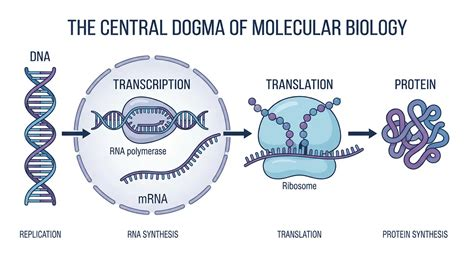

<!-- --- -->
<!---->
<!-- # qPCR measures small numbers of transcripts in bulk -->
<!---->
<!-- <div class="flex justify-center items-center gap-4"> -->
<!-- 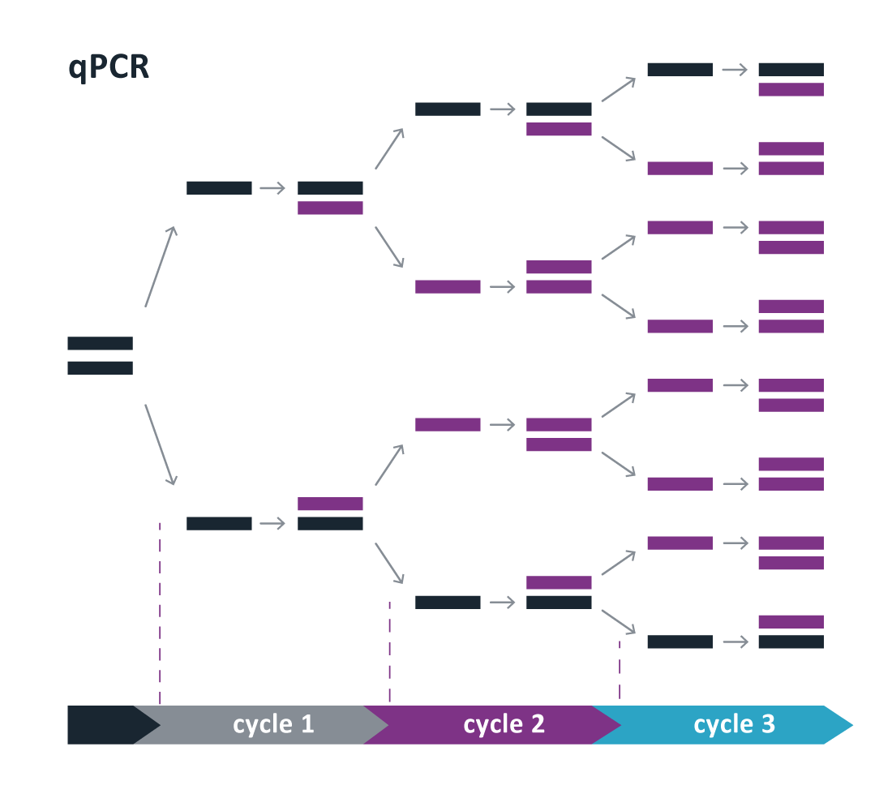 -->
<!-- <v-click> -->
<!-- 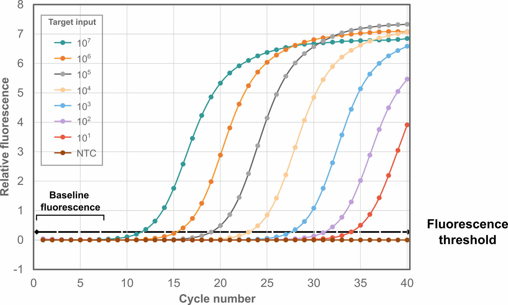 -->
<!-- </v-click> -->
<!-- </div> -->
---

# Cell behavior = genes + transcription + organization

<div class="flex justify-center items-center gap-4">
<div class="flex flex-col gap-4">
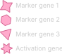
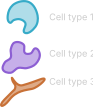
</div>
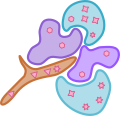
</div>

---

# Bulk RNAseq assembles transcripts, divorced from cell context

<div class="flex justify-center items-center gap-4">

<div class="i-carbon-arrow-right text-primary text-6xl" />
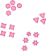
</div>

---

# Single cell RNAseq can measure expression in each cell individually

<div class="flex justify-center items-center gap-4">

<div class="i-carbon-arrow-right text-primary text-6xl" />
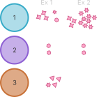
</div>

---

# Spatial transcriptomics measures expression in tissue section at high resolution

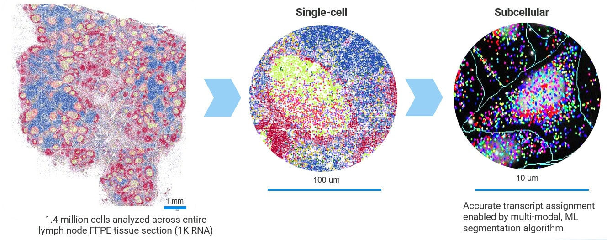

---

layout: section
---

# Spatial 'Omics platforms and their limitations

---

# FISH - the original spatial transcriptomics

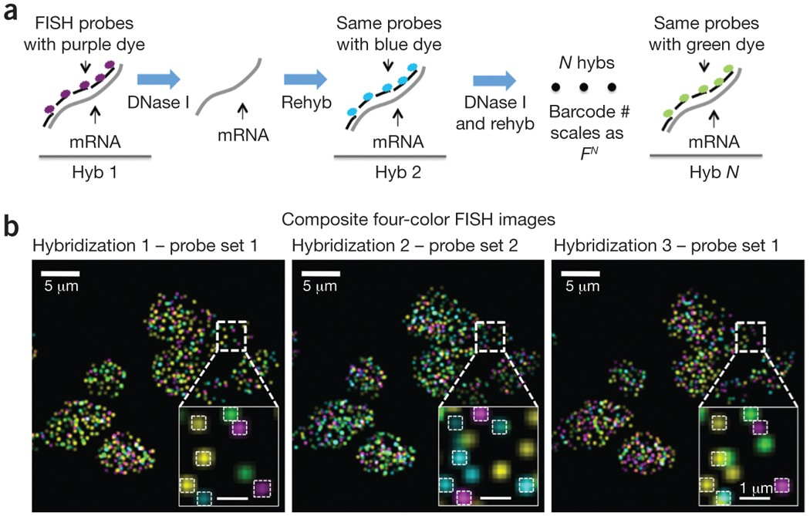

---

# Sequencing-based platforms (eg 10x Visium)

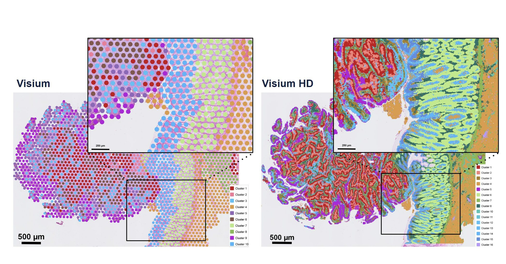
---

# Probe-based (eg 10x Xenium, Nanostring CosMx)


---

# SpatialData Standard

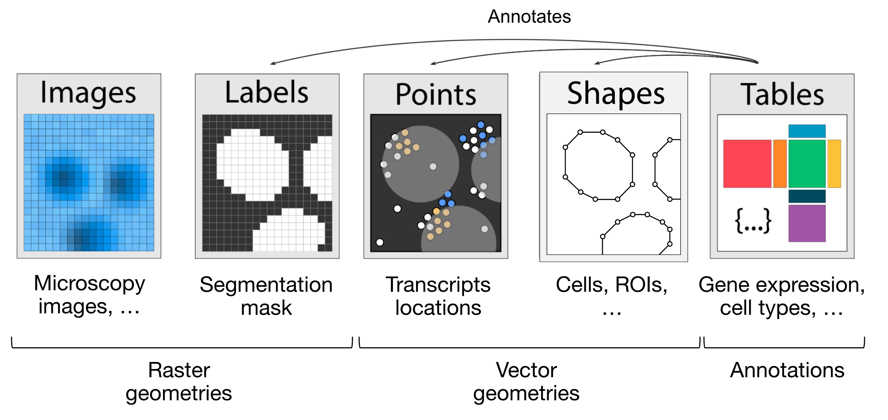
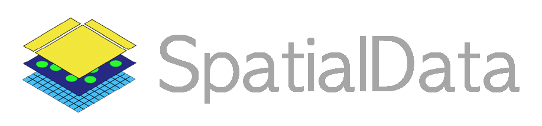

<div class="citation-caption">https://spatialdata.sciverse.org</div>

---

# But... that's a lot of data

<div class="flex items-start gap-8">

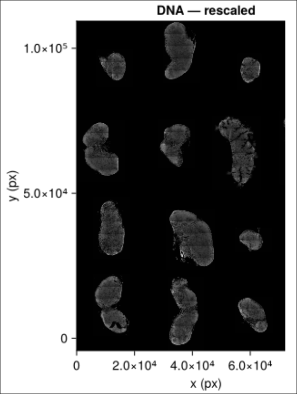
<v-click>
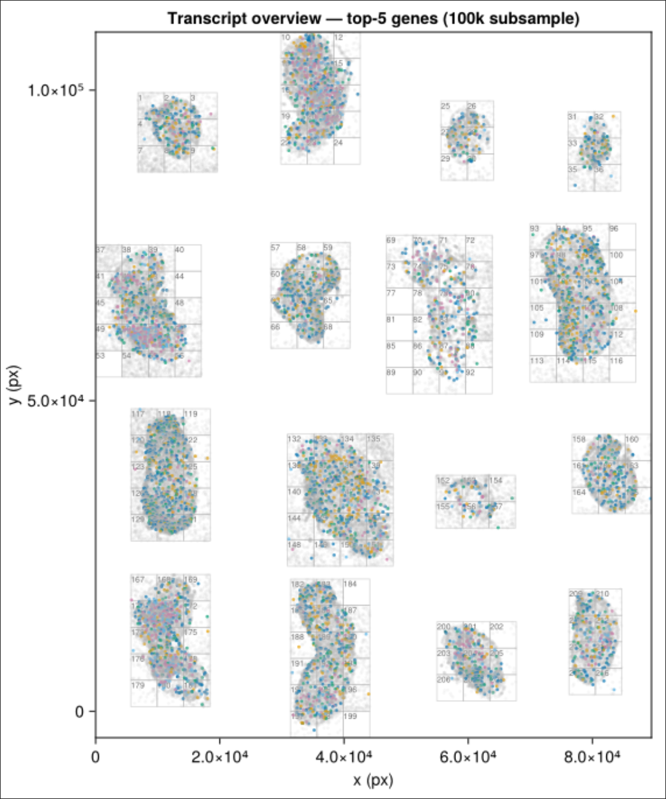
</v-click>

</div>
---
layout: section
---

# SpaitalOmics.jl

Wrapping packages across the Julia ecosystem

---

# Design principles

<v-clicks>

- SpatialData compliant storage (`Zarr.jl`)
- Generic, usable with every company's platform
- Entry and exit at every stage of analysis (JuliaData, `Arrow.jl`, `CSV.jl`, `DataFrames.jl`, etc)
- Visualization-forward (`Makie.jl` recipes for every step)
- Reproducible, flexible, extensible

</v-clicks>

---

# JuliaGeo provides coordinate transformations and spatial analyses

<div class="flex items-start gap-8">

```julia {|4-5|9|10|13}
using SpatialOmics
import SpatialOmics as SO

fov1 = SpatialPoints((; x_px = ..., y_px = ..., target = ...);
    x=:x_px, y=:y_px, gene=:target, coord_system="fov1_px")

# scale px→µm, then place FOV at its stage offset in global frame
fov1_to_global = SO.compose(
    SO.scaling(0.2, 0.2, "fov1_px", "fov1_um"),
    SO.translation(0.0, 0.0, "fov1_um", "global_um")
)

fov1_global = apply(fov1_to_global, fov1)
```

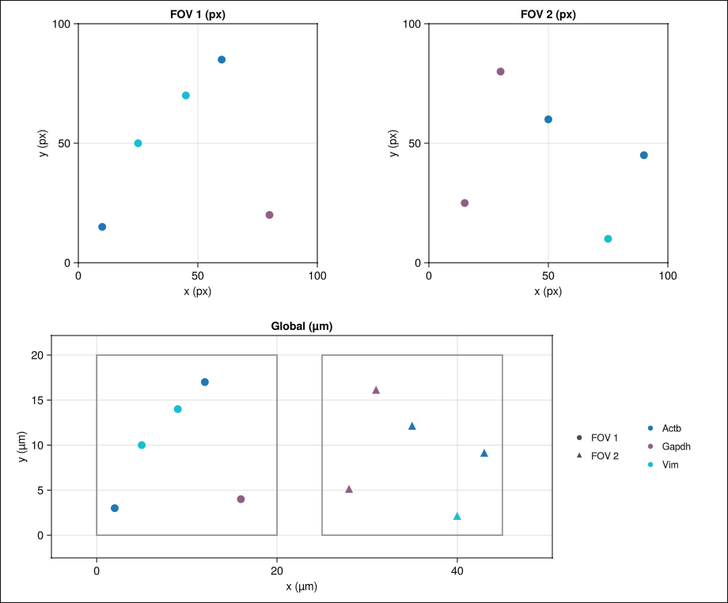

</div>

---

# JuliaImages, JuliaGeo, and Makie for working with visualization

<video src="./images/roi_select.mp4" class="max-h-[24vh] mx-auto" controls autoplay loop muted />

---

# JuliaData for analysis, tabular export

```julia
julia> first(df_raw, 3)
3×4 DataFrame
 Row │ x      y      z      gene
     │ Int64  Int64  Int64  String7
─────┼──────────────────────────────
   1 │  1776   2597      3  Ccl21a
   2 │  2141   2181      3  Lyve1
   3 │  2661   2653      9  Ccl21a
```

<v-click>

```julia
ds = SpatialDataset()
ds["transcripts_raw"] = SpatialPoints(df_raw;
    gene = :gene,
    features = (; z = df_raw.z,),
    coord_system="global_px"
)
```

</v-click>

---

# Julia abstractions for convenience and joy

<div class="flex justify-center items-center gap-4">

```julia
roi = shapes(ds, "overview_roi")

sub = view(points(ds), roi) # or points(ds)[roi]
```

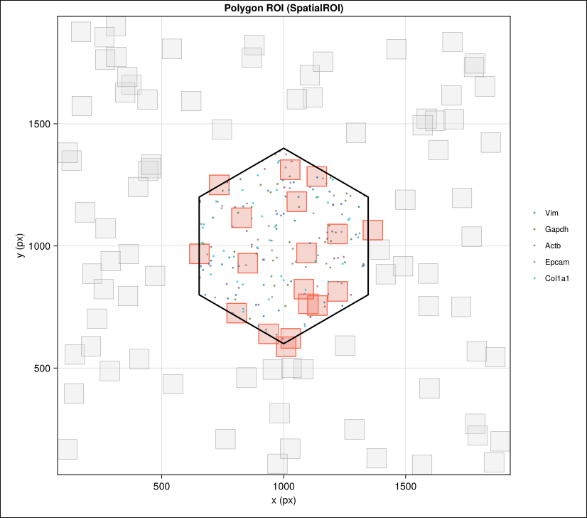
</div>

---

# Future directions

<v-clicks>

- Integration with `SingleCellProjections.jl`
- More spatial-aware machine learning and data analysis (eg clustering, cell-type assignment)
- Lots and lots of tutorials and comparisons with existing tools (I've probably re-invented some wheels)
- Better interactive layers (Makie selection can be slow, esp over ssh)

</v-clicks>

---

layout: center
class: text-center
---

<LabLogo size="5rem" class="mx-auto mb-6" />

# Thank you

<div class="text-ink-muted">

Questions? Reach out — [bonhamlab.bio](https://bonhamlab.bio) · <dev@bonham.ch>

</div>
